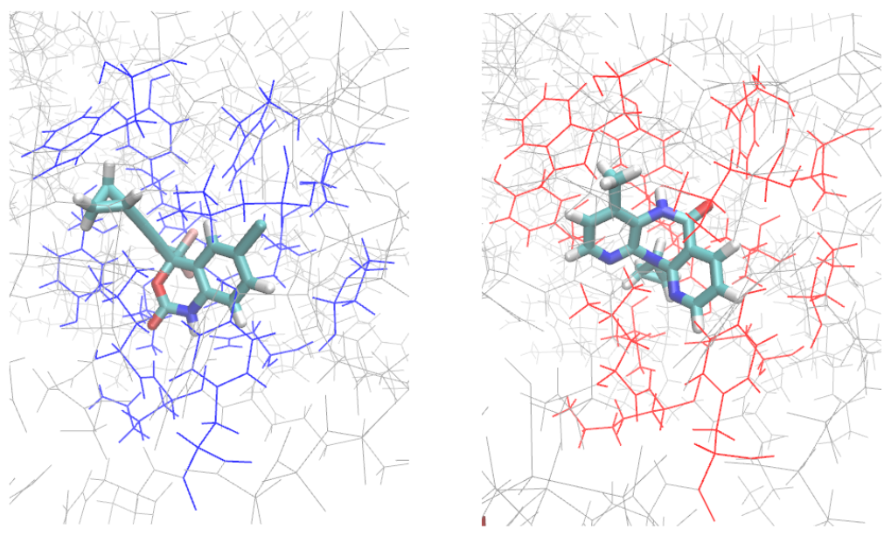

# MolecularSimulation

The notebooks goal is a summarization of the laboratory lessons contents provided by prof. Monika Fuxreiter in the Molecular Simulation class a.y. 2022/2023 at Physics of Data, UniPD.

The PDF is the report of a study in how a different mutation in the HVI-RT protein, affects its spatial configuaration and the interaction with the solute.

